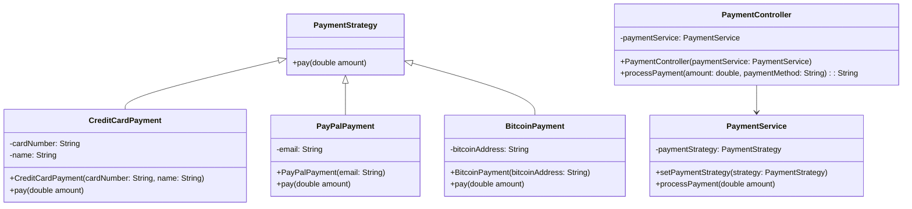

# Lab Padroes Projeto Spring

Sistema de Pagamento Online com Padrão de Estratégia

Descrição:

Este projeto é um exemplo simples de um sistema de pagamento online implementado em Java com Spring Boot, utilizando o padrão de projeto "Estratégia". O padrão de estratégia permite que diferentes métodos de pagamento sejam facilmente adicionados ou modificados sem alterar o código cliente.

Funcionalidades:

Processamento de Pagamentos: O sistema permite o processamento de pagamentos com diferentes métodos, incluindo cartão de crédito, PayPal e Bitcoin.
Componentes do Projeto:

PaymentStrategy (Interface): Define o contrato para as estratégias de pagamento.
CreditCardPayment, PayPalPayment, BitcoinPayment (Implementações de PaymentStrategy): Implementações específicas para os métodos de pagamento.
PaymentService (Serviço): Gerencia a lógica de pagamento e utiliza o padrão de estratégia para realizar o pagamento.
PaymentController (Controlador): Expõe endpoints para processar pagamentos através de solicitações HTTP.

## Diagrama de Classes

